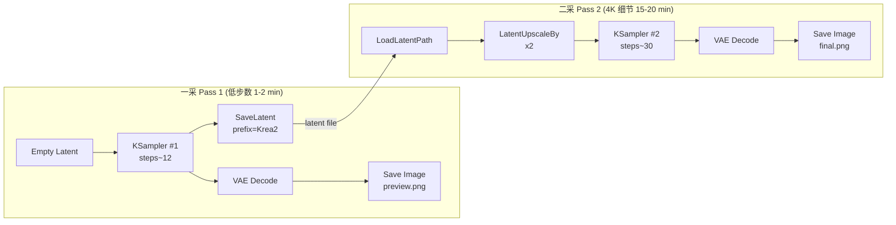

# ComfyUI-SplitSampling-Workflow

**Bilingual ComfyUI split-sampling workflows for the Krea2 + Realism + Engineer stack — one-click toggle between Pass 1 (fast preview) and Pass 2 (4K detail).**

**ComfyUI 分步双采样工作流，专为 Krea2 + Realism + Engineer 模型栈设计，一采出图 → 一键切换 → 二采上 4K 细节。**

---

## 中文简介

一组基于 **ComfyUI** 的**分步双采样工作流**，围绕 **Krea2 + Realism + Engineer LoRA 栈**编写。

**为什么需要分步采样？**

二次采样通常 15–20 分钟。一次性跑完才发现构图不对，会浪费大量时间。把流程拆成两次：

| 阶段 | 时长 | 做什么 |
|---|---|---|
| **一采（Pass 1）** | 约 1–2 分钟 | 低步数快速出图，确定整体构图、光影、姿态 |
| **二采（Pass 2）** | 约 15–20 分钟 | 读回一采保存的 latent，4K 上采样后细化细节、加纹理 |

**核心特性**

- **一键切换**：用 `rgthree-comfy` 的 `Fast Bypasser (rgthree)` + `Fast Groups Bypasser (rgthree)` 把两组节点装进两个筐里，运行前点筐头部切换要不要跳过
- **种子同步**：一采和二采共享同一个 `Seed Generator` 节点，每张图都唯一可复现
- **不撞缓存**：每次运行都是新图，不会因为种子缓存被跳过
- **显存友好**：一采图直接落盘成 `.latent` 文件，二采时按路径读回，避开显存爆炸
- **依赖极简**：核心开关只用了 9 个自定义节点包，全是社区主流维护的

**适用场景**

- 显存 < 12 GB、单次 4K 采样会 OOM 的显卡
- 想"先看构图再决定是否上细节"的工作流
- 出图量大、需要节省迭代时间的批量生产

---

## English

A pair of **ComfyUI split-sampling workflows** built around the **Krea2 + Realism + Engineer LoRA stack**.

**Why split-sampling?**

A full-detail 4K pass typically takes 15–20 minutes. If the composition is wrong, all that time is wasted. Splitting it into two passes fixes this:

| Phase | Time | What it does |
|---|---|---|
| **Pass 1** | ~1–2 min | Low-step quick render for layout, lighting, pose |
| **Pass 2** | ~15–20 min | Loads Pass 1's saved latent, upscales to 4K, refines detail |

**Key features**

- **One-click toggle** — `rgthree-comfy`'s `Fast Bypasser` + `Fast Groups Bypasser` group the two passes into bypasser frames; click the frame header to skip a pass
- **Seed sync** — both passes share a single `Seed Generator` node, so every image is uniquely reproducible
- **No cache skip** — each run produces a fresh image, the seed cache never short-circuits it
- **VRAM-friendly** — Pass 1's latent is saved to disk; Pass 2 reads it back by path instead of keeping it in VRAM
- **Minimal deps** — only 9 custom-node packs, all actively maintained

**Use cases**

- GPUs under 12 GB VRAM where a single 4K pass OOMs
- "See the composition, then decide if it's worth a detail pass" workflows
- High-volume batch jobs that need fast iteration

---

## Workflows in this repo / 本仓库工作流

| File | Stack | Pass-2 latent loader | Notes |
|---|---|---|---|
| `workflows/Krea2+Realism+Engineer+v2-文生图-分步双采样（一采二采一键切换）.json` | Krea2 + Realism + Engineer | `LoadLatentPath` (linkable STRING input) | **Recommended / 推荐** |
| `workflows/Lolita-Krea2+Realism+Engineer+v2-文生图-分步双采样（一采二采一键切换）.json` | Lolita + Krea2 + Realism + Engineer | Built-in `LoadLatent` (manual dropdown) | Variant — requires manual latent file selection |

---

## Required custom nodes / 必需的自定义节点

The workflows reference these custom nodes. They are NOT shipped with ComfyUI; install each one (ComfyUI Manager recommended).

工作流引用了以下自定义节点，**全部需要单独安装**（推荐用 ComfyUI Manager）：

| Node used in workflow | Pack | GitHub |
|---|---|---|
| `LoadLatentPath` | ComfyUI-LoadLatentPath | https://github.com/BingJYYY/ComfyUI-LoadLatentPath |
| `Fast Bypasser (rgthree)` · `Fast Groups Bypasser (rgthree)` · `Label (rgthree)` | rgthree-comfy | https://github.com/rgthree/rgthree-comfy |
| `DisplayAny` | ComfyUI_essentials | https://github.com/cubiq/ComfyUI_essentials |
| `Text Concatenate` | was-node-suite-comfyui | https://github.com/WASasquatch/was-node-suite-comfyui |
| `Seed Generator` · `String Literal` | comfy-image-saver | https://github.com/giriss/comfy-image-saver |
| `Seed String` | mikey_nodes | https://github.com/bash-j/mikey_nodes |
| `Note _O` | ComfyUI-QualityOfLifeSuit_Omar92 | https://github.com/omar92/ComfyUI-QualityOfLifeSuit_Omar92 |
| `ShowText\|pysssss` | ComfyUI-Custom-Scripts | https://github.com/pythongosssss/ComfyUI-Custom-Scripts |
| `ConditioningKrea2Rebalance` | ComfyUI-ConditioningKrea2Rebalance | https://github.com/nova452/ComfyUI-ConditioningKrea2Rebalance |

> Standard ComfyUI built-in nodes (`KSampler`, `VAEDecode`, `CLIPLoader`, `UNETLoader`, `LoraLoaderModelOnly`, `CLIPTextEncode`, `EmptyLatentImage`, `LatentUpscaleBy`, `VAELoader`, `SaveImage`, `SaveLatent`, `PreviewImage`, `ConditioningZeroOut`, `LoadLatent`) need no install.
>
> 内置节点（`KSampler`、`VAEDecode`、`CLIPLoader`、`UNETLoader`、`LoraLoaderModelOnly`、`CLIPTextEncode`、`EmptyLatentImage`、`LatentUpscaleBy`、`VAELoader`、`SaveImage`、`SaveLatent`、`PreviewImage`、`ConditioningZeroOut`、`LoadLatent`）无需额外安装。

---

## Required models / 必需的模型

The workflows assume the following are already installed in your ComfyUI:

工作流默认假设你已经安装：

- **Krea2** UNet + CLIP + VAE
- **Realism.safetensors** LoRA
- **Engineer.safetensors** LoRA

Adjust the file names in the `UNETLoader` / `CLIPLoader` / `LoraLoaderModelOnly` nodes to match what you have on disk.

请根据你本地的模型文件名，调整 `UNETLoader` / `CLIPLoader` / `LoraLoaderModelOnly` 节点中对应的下拉选项。

---

## How to use / 使用方法

1. **Install the custom nodes above** (skip any you already have). / 安装上方列出的自定义节点（已装的跳过）。
2. **Open one of the workflow JSONs** in ComfyUI. / 在 ComfyUI 里打开其中一个工作流 JSON。
3. **Adjust model paths** in `UNETLoader` / `CLIPLoader` / `LoraLoaderModelOnly` to match your install. / 调整模型路径。
4. **Edit prompts** in the `CLIPTextEncode` nodes. / 在 `CLIPTextEncode` 节点里编辑提示词。
5. **Toggle Pass 1 / Pass 2** by clicking the rgthree bypasser frame header. / 通过 rgthree 筐头部切换一采 / 二采。
6. **Click `Queue Prompt`** to run. / 点击 Queue Prompt 运行。

> 切换说明：筐头部亮蓝 = 启用、灰色 = 跳过。第一次跑一采，先把二采筐调成灰色；满意后再把一采筐调成灰色、跑二采。

---

## How it works / 原理简述

Pass 1 produces a low-step preview image **and** saves the latent tensor to disk (under `ComfyUI/output/latents/`). When you toggle Pass 2 on, `LoadLatentPath` reads that file back by path (auto-derived from the shared seed), upscales the latent 2x, and runs a longer KSampler pass for detail. Because the seed is shared, Pass 2's output is fully deterministic given the same prompts.

一采同时输出低步数预览图 **和** 保存 latent 到 `ComfyUI/output/latents/`。切换到二采后，`LoadLatentPath` 按路径读回这个 latent，2 倍上采样后用更长步数细化。因为一采二采共享同一个 seed，给定相同提示词，二采结果完全可复现。

---

## License

MIT
